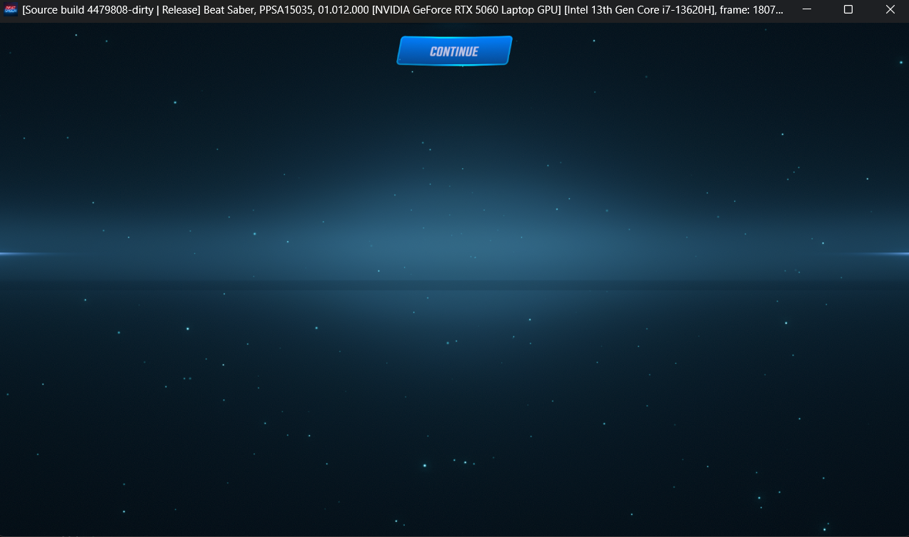

# Inori

A PlayStation 5 emulator fork. Two equal goals: get more games running, and get PSVR2 games onto ordinary PC VR headsets.

Inori is based on [KytyPS5](https://github.com/KytyPS5/KytyPS5), which itself grew out of [Kyty](https://github.com/InoriRus/Kyty) by **InoriRus** (Vladimir M). The name is a nod to that original work. We are not the upstream KytyPS5 team, and we are not affiliated with Sony or PlayStation.

> [!IMPORTANT]
> Use only game dumps you own legally. This project does not ship games or Sony system software.

## Goals (both matter)

1. **More games** - broader flat-title compatibility, clearer crash to fix loops, better HLE and Windows host fixes.
2. **PSVR2** - bring PSVR2 titles up through the same emulator, then present them through OpenXR so people can use the headset they already have.

We work both tracks. A flat boot blocker and a VR present blocker are both first-class work.

Right now this is early. Expect crashes, missing HLE, and lots of logging while we chase blockers.

## Status

Active local development. Upstream KytyPS5 already boots many 2D and some 3D titles. Our fork adds compatibility work on top (for example red-zone / Windows ABI fixes and game-specific HLE). PSVR2 / OpenXR work is underway as a peer track, not a side quest.

For general KytyPS5 game reports, see the [community compatibility list](https://kytyps5.github.io/).

## Screenshots

### Beat Saber (PSVR2)

Reached the in-game Continue screen on the Desktop build of this fork (title id PPSA15035). Visuals look good; further progress needs a connected VR session for Sense input.

  

## Credits

- **InoriRus / Kyty** for the foundation
- **KytyPS5** contributors for the modern emulator this fork starts from
- Everyone who files traces and helps patch blockers

## License

Same as upstream: [GPL-2.0](LICENSE).

## Building

Follow the build docs in this repo (same toolchain as KytyPS5: CMake, Ninja, clang-cl on Windows, Qt, Vulkan). Details live in the rest of the tree. We will keep this README short until the fork has its own release notes.

## Contributing

Open issues and PRs here. Prefer a short log snippet and the title ID when something crashes. Flat games and PSVR2 titles are both welcome test cases.

Thanks for checking Inori out.
